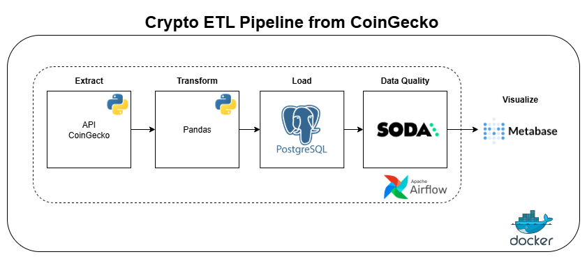
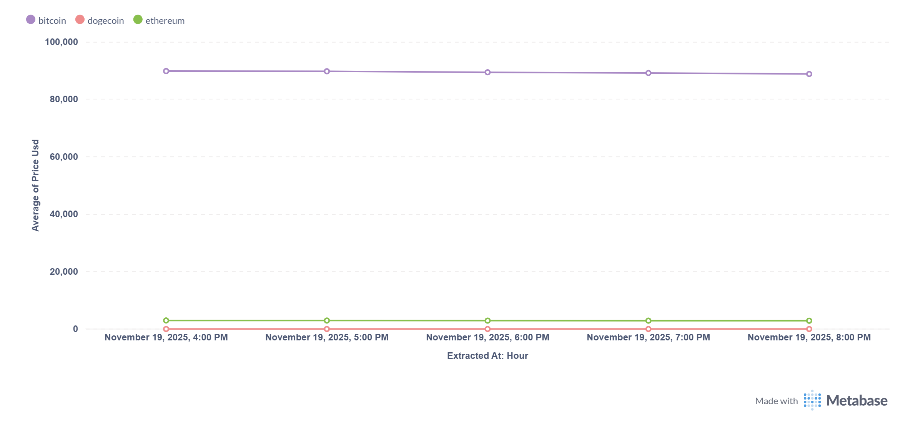

# Pipeline ETL de Criptomoedas com Airflow, Postgres e Metabase

Este projeto implementa um pipeline completo de Engenharia de Dados que extrai preços de criptomoedas em tempo real, armazena em um Data Warehouse no PostgreSQL e disponibiliza visualizações no Metabase.

O objetivo é monitorar a variação horária do **Bitcoin**, **Ethereum** e **Dogecoin**, permitindo acompanhar tendências.

---

## Arquitetura

1. **Extração (Extract)** O Airflow consulta a API da CoinGecko a cada hora usando o `HttpOperator`.

2. **Transformação (Transform)** Os dados são processados com Pandas: normalização, flatten do JSON e inclusão de timestamp (UTC).

3. **Carga (Load)** Os dados são inseridos em um banco PostgreSQL utilizando a técnica de **Upsert/Idempotência**, garantindo que não haja duplicidade de dados se a pipeline rodar mais de uma vez no mesmo horário.

4. **Visualização** O Metabase lê diretamente o banco para gerar dashboards interativos e gráficos de tendências.

---

## Tecnologias Utilizadas

| Componente | Tecnologia |
|------------|------------|
| Orquestração | Apache Airflow 2.10 (Docker) |
| Linguagem | Python 3.12 (Pandas) |
| Banco de Dados | PostgreSQL 13 |
| Visualização | Metabase |
| Infraestrutura | Docker & Docker Compose |

---

## Diagrama e Dashboard

### **Diagrama do Pipeline**


### **Dashboard no Metabase**


> *Obs: Dashboard ilustrativo apenas com 5 horas de captura de dados.*

---

## Como Executar

### **Pré-requisitos**
- Docker e Docker Compose instalados.
- Chave de API CoinGecko (Demo gratuita).

### **Passo a Passo**

### 1. Clone o repositório
```bash
git clone https://github.com/vinisouzza/crypto-etl-airflow.git
cd crypto-etl-airflow
```

### 2. Suba o ambiente
Este comando irá construir a imagem customizada do Airflow (com as libs necessárias) e iniciar os serviços (Postgres, Metabase, etc).
```bash
docker-compose up -d --build
```
*Aguarde alguns instantes até que todos os containers estejam com status "Healthy".*

### 3. Configure a Conexão no Airflow
1. Acesse `http://localhost:8080` (Login: `airflow` / Senha: `airflow`).
2. Vá em **Admin** -> **Connections** e clique no **+**.

**A. Conexão da API (CoinGecko):**
   - **Conn Id:** `http_coingecko`
   - **Conn Type:** `HTTP`
   - **Host:** `https://api.coingecko.com`
   - **Extra:** `{"x-cg-demo-api-key": "SUA_API_KEY_AQUI"}`

**B. Conexão do Banco (Postgres):**
   - **Conn Id:** `postgres_dw`
   - **Conn Type:** `Postgres`
   - **Host:** `postgres`
   - **Login:** `airflow`
   - **Password:** `airflow`
   - **Schema:** `airflow`
   - **Port:** `5432`

### 4. Execute a DAG
Na tela inicial, ative a DAG `crypto_etl_pipeline_psql` (botão ON/OFF).

Clique no botão **Play (Trigger DAG)** na coluna "Actions".

### 5. Conecte o Metabase
- Acesse `http://localhost:3000`.
- Crie sua conta de administrador.
- Na configuração de banco de dados, selecione PostgreSQL e use:
    - **Host**: `postgres`
    - **Database name**: `airflow`
    - **Username**: `airflow`
    - **Password**: `airflow`
Crie seus gráficos explorando a tabela crypto_prices.
